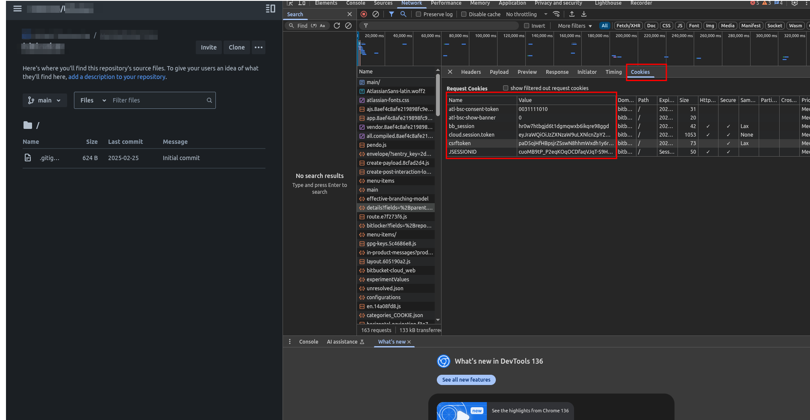

# Bitbucket LFS Cleanup Script

This Python script helps you delete Git LFS files from your Bitbucket repository by mimicking browser behavior using session cookies. It is intended for **personal/admin use only** and is **not affiliated with Atlassian or Bitbucket**.

### Usage
The script provides three options: `--fetch`, `--locate`, and `--delete`.

`--fetch`: Retrieves all the OIDs of the Git LFS objects in the repository and saves them to the file `git-lfs-data.txt`.

`--locate`: Reads all the OIDs from the `git-lfs-data.txt` file and checks against the Git log to determine if any commits still reference them. If none are found, it outputs the information of the Git LFS objects to the file `dangling-git-lfs-data.txt`.

`--delete`: Reads all the OIDs from the `dangling-git-lfs-data.txt` file and performs the delete operation.

### Instructions for Using the Script

Before doing the steps below, remember to install the required dependencies: `pip install -r requirements.txt`

1. Navigate to **Repository Settings** and select **Git LFS**.
2. Open the Chrome browser and press `F12` to access the Developer Tools. Navigate to the **Network** tab and search for the following URL:  
   `admin/lfs/file-management`
3. In the **Cookies** tab, copy all the cookies and update the `cookies` map in the `config.py` file with the copied values.  
   
4. Perform the cleanup process by executing the following command:  
   ```bash
   python git-lfs-bitbucket.py --fetch --locate --delete
   ```

> **Note:** This is a destructive process. Once files are deleted from Bitbucket Cloud, they are permanently removed. While it is uncertain if the files are completely erased from Bitbucket's backend, this action is irreversible. Proceed with caution.

## Disclaimer

**USE AT YOUR OWN RISK.**

This script:
- Requires you to be logged into Bitbucket in your browser.
- Requires you to manually provide your session cookies.
- Is not an official API client and may stop working if Bitbucket changes their website.

The author is not responsible for any misuse or account issues. Always comply with Bitbucket's Terms of Service.